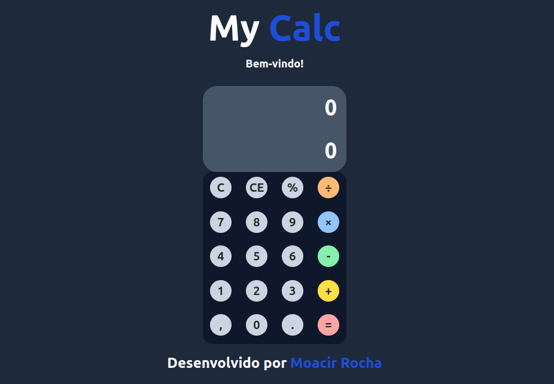

# Uma calculadora simples
 Uma calculadora simples usando HTML, TailwindCSS e Javascript
 
 Esta é uma calculadora simples com as funcionalidades usando JavaScript. A lógica é bem simples com o mínimo possível de código.
 
## Passos para executar a calculadora:
- Faça Download do código inteiro. 
- Abra o arquivo index.html.

## Technologies used: 
- HTML [https://img.shields.io/badge/HTML5-E34F26?style=for-the-badge&logo=html5&logoColor=white]
- Tailwind CSS [https://img.shields.io/badge/Tailwind_CSS-38B2AC?style=for-the-badge&logo=tailwind-css&logoColor=white]
- Javascript [Logic/Working of calculator](https://img.shields.io/badge/JavaScript-F7DF1E?style=for-the-badge&logo=javascript&logoColor=black)]

# A simple Calculator
 A simple calculator using HTML, CSS &amp; Javascript
 
 This is a simple calculator functionality achieved using Javascript. The logic is very simple with the minimum lines of code possible.
 
## Steps to execute this calculator:
- Download the entire code 
- Open up the index.html.

## Technologies used: 
- HTML
- CSS [style/Presentation]
- Javascript [Logic/Working of calculator]
